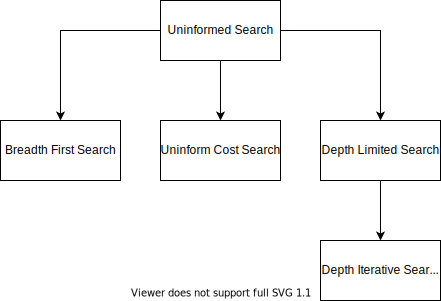
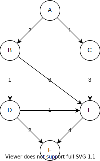

# Uninformed Searches
Uninformed searches in which we only know:
- The goal test
- The successors() function

In other words, uninformed does **not** know which non-goals states are better.

- [1. The Searches](#1-the-searches)
  - [1.1. Breadth-First Search (BFS)](#11-breadth-first-search-bfs)
  - [1.2. Uniform-Cost Search (UCS)](#12-uniform-cost-search-ucs)
  - [1.3. Depth-Limited Search (DLS)](#13-depth-limited-search-dls)
  - [1.4. Iterative-Deepening Search (IDS)](#14-iterative-deepening-search-ids)
- [2. The Implementation](#2-the-implementation)
  - [2.1. Building a Graph](#21-building-a-graph)
  - [2.2. Searching a Graph](#22-searching-a-graph)
- [License](#license)

## 1. The Searches

### 1.1. Breadth-First Search (BFS)
| Time Complexity  | Space Complexity | Complete        | Optimal                         |
|------------------|------------------|-----------------|---------------------------------|
| O(b<sup>d</sup>) | O(b<sup>d</sup>) | Yes (if finite) | Yes (if all edges are the same) 

Breadth-first search is a search in which nodes are expanded via the shallowest node first:
- Examine states *one* step away from the initial state.
- Examine states *two* steps away from the initial state.
- and so on...

Consequently, this does not guarantee the optimal path. However, this does guarantee that the resultant path will have the least number of edges.

### 1.2. Uniform-Cost Search (UCS)
| Time Complexity  | Space Complexity | Complete        | Optimal                         |
|------------------|------------------|-----------------|---------------------------------|
| O(b<sup>d</sup>) | O(b<sup>d</sup>) | Yes (if finite) | Yes 

When all step costs are equal, BFS is optimal because it always expands the shallowest unexpanded node. This is not true when step cost are not equal. By a simple extension, there is an algorithm that is optimal with any step-cost function.

Compared to BFS, Instead of expanding the shallowest node, UCS expands the node n with the lowest path cost g(n).
Let g(n) = cost of path from start node s to current node n
Thus, nodes are sorted by by increasing value of g using a priority queue to order nodes on the frontier list.

### 1.3. Depth-Limited Search (DLS)
| Time Complexity  | Space Complexity | Complete        | Optimal                         |
|------------------|------------------|-----------------|---------------------------------|
| O(b<sup>m</sup>) | O(bm) | No (loops or infinite non-goal path) | No

The depth-limited search expands via the *deepest* node first. Specifically:
- Select a direction go to the end.
- Slightly change the end
- Slightly change the end some more...
- Once a node has been expanded, it can be removed from memory as soon as all its descendants have been explored.

However, however only performs up to a certain level l where l is less than or equal to the depth of the graph.

### 1.4. Iterative-Deepening Search (IDS)
| Time Complexity  | Space Complexity | Complete        | Optimal                         |
|------------------|------------------|-----------------|---------------------------------|
| O(b<sup>d</sup>) | O(bd) | Yes (if finite) | Yes 

As an extension of DFS, IDS becomes optimal by doing a DFS search level by level:

- Perform DFS to a depth of 1 and treat all children of the start node a leaves.
- If no solution found, do DFS to a depth of 2.
- Repeat by increasing *depth bound* until a solution is found.

Trades a little time for a huge reduction in space: lets you do a BFS search with a (more space efficient) depth-first search.

## 2. The Implementation
The aforementioned searches have been implemented using C# and the .NET 6.0 framework.

They use the following inheritance structure where are searches are derived from the `UninformedSearch` class.


Additionally, all implementations make use of Object-Oriented approach that makes extensive use of a [`Node`](UninformedSearches/Node.cs) and [`Arc`](UninformedSearches/Arc.cs) class instead of matrices and adjacency lists. The classes were used to avoid overhead in non-sparse graphs.

All source files can be found in [`UninformedSearches/`](UninformedSearches/). 
The specific implementations for each search can be found in [`UninformedSearches/Searches`](UninformedSearches/Searches).

### 2.1. Building a Graph

The following graph can be built using Nodes and Arcs as follows.

**The Graph**


**Source Code**
```c#
    Node<char> a = new('A');
    Node<char> b = new('B');
    Node<char> c = new('C');
    Node<char> d = new('D');
    Node<char> e = new('E');
    Node<char> f = new('F');

    a.AddArc(b, 2);
    a.AddArc(c, 1);

    b.AddArc(d, 1);
    b.AddArc(e, 3);

    c.AddArc(e, 3);

    d.AddArc(e, 1);
    d.AddArc(f, 2);

    e.AddArc(f, 4);
```

### 2.2. Searching a Graph
Once a graph is constructed, simply pass the start node and destination node in a class derived from [`UninformedSearch`](UninformedSearches/Searches/UninformedSearch.cs).

```#
    UninformedSearch<T> ucs = new UniformCostSearch<T>();

    .
    .
    .
    Build your graph here
    .
    .
    .

    List<Node<T>>ucs.GetPath(start, destination);
```

For instance, in the case of the [section 2.1](#21-building-a-graph) graph, if you wanted to find the path from 'A' to 'E', the code would like:
```c#
    UninformedSearch<char> ucs = new UniformCostSearch<char>();

    Node<char> a = new('A');
    Node<char> b = new('B');
    Node<char> c = new('C');
    Node<char> d = new('D');
    Node<char> e = new('E');
    Node<char> f = new('F');

    a.AddArc(b, 2);
    a.AddArc(c, 1);
    b.AddArc(d, 1);
    b.AddArc(e, 3);
    c.AddArc(e, 3);
    d.AddArc(e, 1);
    d.AddArc(f, 2);
    e.AddArc(f, 4);

    List<Node<T>>ucs.GetPath(a, e);
```

## License
[](LICENSE.md)